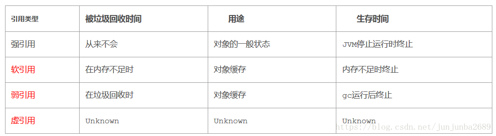

# GC常见面试题

## Object的finalize()方法的作用是否与C++的析构函数的作用相同
- 与C++的析构函数不同，析构函数调用确定，而它的是不确定的
- 将为被引用的对象放置于 F-Queue队列中
- 方法执行随时可能会被终止
- 给于对象最后一次重生的机会


## Java中的强引用、软引用、弱引用、虚引用有什么用?

### 强引用(Strong Reference)
- 最普遍的引用: `Object obj = new Object();`
- 抛出`OutOfMemoryError`终止程序也不会回收具有强引用的对象
- 通过将对象设置为null来弱化引用，时期被回收


### 软引用(Soft Reference)
 - 对象处在有用但非必须的状态
 - 只有当内存空间不足时，GC会回收该引用的对象的内存
 - 可以用来实现高速缓存
 
 ```java
String str = new String("abc"); //强引用
SoftReference<String> softRef = new SoftReference<String>(str); //软引用

```

### 弱引用(Weak Reference)
- 非必须的对象,比软引用更弱一些
- GC时会被回收
- 被回收的概率也不大，因为GC线程优先级比较低
- 适用于引用偶尔被使用且不影响垃圾收集的对象

```java
String str = new String("abc"); //强引用
WeakReference<String> softRef = new WeakReference<String>(str); //弱引用
```

### 虚引用(Phantom Reference)
- 不会决定对象的生命周期
- 任何时候都可能被垃圾回收期回收
- 跟踪对象被垃圾收集器回收的活动，起哨兵的作用
- 必须和引用队列`ReferenceQueue`联合使用
```java
String str = new String("abc"); //强引用
ReferenceQueue queue = new ReferenceQueue();
PhantomReference softRef = new PhantomReference(str,queue); //虚引用
```


