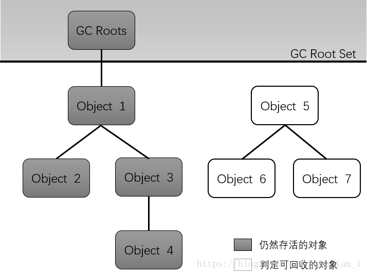

# Java垃圾回收机制

## 对象被判断为垃圾的标准?
没有被其他对象引用

## 判断对象是否为垃圾的算法
### 1.引用计数算法
- 通过判断对象的引用数量来决定对象是否可以被回收
- 堆中的每个对象都有一个引用计数器，被引用则+1,完成引用则-1
- 任何引用计数为0的对象实例可以被当做垃圾收集

**优点**
- 执行效率高，程序执行首影响较小

**缺点** 
- 无法检测出循环引用的情况，导致内存泄漏

### 2. 可达性分析算法
- 通过判断对象的引用链是否可达来决定对象是否可以回收。

**可以作为GC ROOT的对象**
- 虚拟机栈中引用的对象(栈帧中的本地变量表)
- 方法区中的常量引用的对象
- 方法区中的类静态属性引用的对象 
- 本地方法栈中JNI(Native方法)的引用对象

## 垃圾回收算法?
### 1.标记清除算法(Mark and Sweep)
- 标记: 从根集合进行扫描，对存活的对象进行标记
- 清除: 对堆内存从头到位进行线性遍历，回收不可达对象内存

**缺点**: 效率低、碎片化

### 2. 复制算法(Copying)
1. 分为对象面和空闲面
2. 对象在对象面上的创建
3. 存活的对象被从对象面复制到空闲面
4. 将对象面所有对象内存清除掉

**特点**
- 解决了碎片化问题
- 顺序分配内存，简单高效
- 适用对象存活率低的场景
- 这种算法回收年轻代

### 3. 标记-整理算法
- 标记: 从根集合进行扫描，堆存活的对象进行标记
- 清除:移动所有存活的对象，且按照内存地址次序依次排列，然后将末端内存地址以后的内存全部回收

**特点**
- 避免内存的不连续性
- 不用设置两块内存互换
- 适用于存活率高的场景

### 4. 分代收集算法(Generational Collecor)
- 垃圾回收算法的组合拳
- 按照对象生命周期的不同划分区域以采用不用的垃圾回收算法
- 目的是提供JVM的回收效率

> 参考
> - [GC算法&回收器](https://www.cnblogs.com/wanhua-wu/p/6582994.html)
