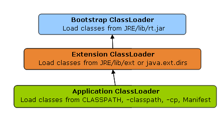

# ClassLoader

## 什么是ClassLoader，有什么作用?
ClassLoader在Java中有着非常重要的作用,它主要工作在Class装在的加载阶段，器主要作用是从系统外部获得Class的二进制数据流。它是java的核心组件，所有的Class都是有ClassLoad儿进行加载的，ClassLoader负责通过将Class的二进制数据流装在进系统，然后交给Java虚拟机进行连接，初始化等操作。

## ClassLoader的种类
- `BootStrapClassLoader`:C++编写,加载核心库,java.* 包的类 
- `ExtClassLoader`: Java 编写,加载扩展库, javax.* 包的类
- `AppClasLoader`: java编写,加载classpath路径下的class
- `CutomClassLoader`: 用户自定义的classloader

## 什么是类加载的动态性
一个应用程序总是由n多个类组成，Java程序启动时，并不是一次把所有的类全部加载后再运行，它总是先把保证程序运行的基础类一次性加载到jvm中，其它类等到jvm用到的时候再加载，这样的好处是节省了内存的开销，因为java最早就是为嵌入式系统而设计的，内存宝贵，这是一种可以理解的机制，而用到时再加载这也是java动态性的一种体现

## 类加载的双亲委派机制
自底向上检查类是否已经加载，自顶向下尝试加载类。

> 类装载器有载入类的需求时，会先请示其Parent使用其搜索路径帮忙载入，如果Parent 找不到,那么才由自己依照自己的搜索路径搜索类

## 为什么要使用双亲委派机制加载类?
避免多样同样字节码的加载
